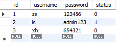
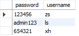
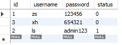
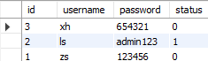
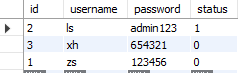
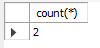
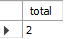
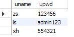

> 语法大小写不敏感

> -- 是注释
- [where 的使用](#where-的使用)
    - [演示 where 字句的使用](#演示-where-字句的使用)
- [运算符](#运算符)
    - [用 and 显示 所有 status 为 0 id 大于 3 的用户](#用-and-显示-所有-status-为-0-id-大于-3-的用户)
    - [使用 or 来查找 所有状态为 1 或 zs 的用户](#使用-or-来查找-所有状态为-1-或-zs-的用户)
- [排序](#排序)
    - [对 users 表中的数据，按照 status 字段进行升序排序](#对-users-表中的数据按照-status-字段进行升序排序)
    - [对 users 表中的数据，按照 id 字段进行降序排序](#对-users-表中的数据按照-id-字段进行降序排序)
    - [多重排序](#多重排序)
- [count(*) 函数](#count-函数)
    - [查询users表中 status 为0 的总数据条数](#查询users表中-status-为0-的总数据条数)
- [as 关键字](#as-关键字)
    - [把 username 别名为 uname password别名为 upwd](#把-username-别名为-uname-password别名为-upwd)

### 通过 * 把 users 所有数据查询出来

```
select * from users
```



### 从 users 中把 password 和 username 数据查询出来

```
select username,password from users
```




### 向 users 表中，插入新数据，username 的值为 tongy stark password 的值为 098123

```
insert into (username,password) values ('tongy stark','09812')
```


### 删除 users 表中 id=4 的用户

```
delete from users where id=4
```


### 将用户 id 为 4 的 密码 改为 888888

```
update users set password='888888' where id=4
```

### 更新 id=2 的用户的用户密码 为 admin123 同时把状态改为 1

```
update users set password='admin123',status='1' where id=2

```

# where 的使用

### 演示 where 字句的使用

```
select * from users where status=1 -- 列出 status=1的
delete from users where id>3   -- 删除
```

# 运算符

```
and -- 同时满足多个条件
or  -- 满足一个条件即可
```

### 用 and 显示 所有 status 为 0 id 大于 3 的用户

```
select * from users where status=0 and id>3
```

### 使用 or 来查找 所有状态为 1 或 zs 的用户

```
select * from users where status=1 or username=zs
```

# 排序

### 对 users 表中的数据，按照 status 字段进行升序排序

-   order by 是排序关键字
-   desc 表示的是 降序
-   asc 表示升序 (默认是升序)

```
select * from users order by status
```



### 对 users 表中的数据，按照 id 字段进行降序排序

-   desc 表示降序

```
select * from users order by id desc
```

### 多重排序
+ 对users表中先按照 status 降序排序 在按照 username 进行升序排序
```
select * from users order up status desc , username asc
```

# count(*) 函数

### 查询users表中 status 为0 的总数据条数
```
select count(*) from users where status=0
```


+ 使用 as 給列起别名
```
select count(*) as total from users where status=0
```


# as 关键字
+ as 修改输出结果的列名
### 把 username 别名为 uname password别名为 upwd
```
select username as uname ,password as upwd from users
```
